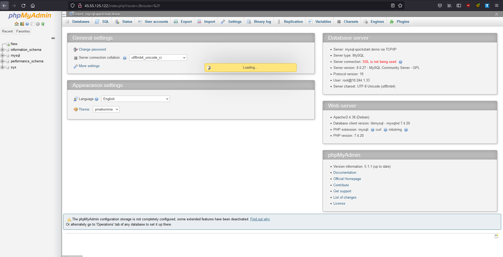
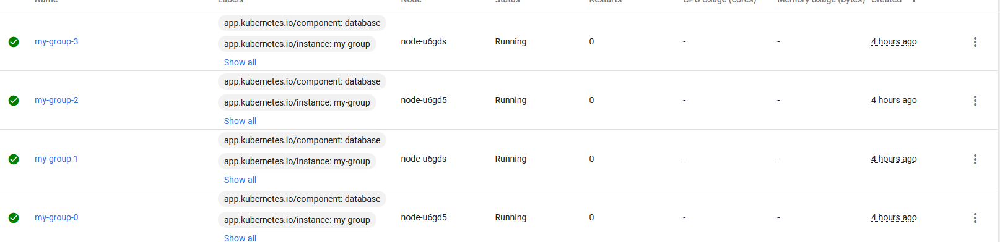
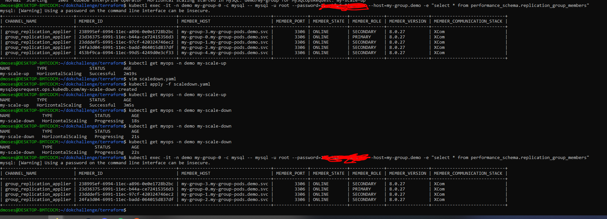

# Welcome

This is my submission for the DigitalOcean Kubernetes Challenge, which involves
using DigitalOcean's Kubernetes services to complete a project. This was a 
great way for me to finally learn how to use Kubernetes as well as a great 
introduction to Terraform.

# Project

I chose to try out the Deploy a Scalable SQL Cluster challenge. 

The requirements are:
- Redundancy
- Scalable(I chose to use horizontal scaling)

## First Steps

- I didn't even know how to provision a Kubernetes cluster at first so I first
followed the steps on how to do that from one of the excellent 
[presentations](https://www.youtube.com/watch?v=dCv6dRjtgHI) at the 
DigitalOcean Deploy Conference. 
[This guide](https://www.digitalocean.com/community/tutorials/how-to-use-terraform-with-digitalocean) 
is what became `provider.tf` later on.

- This is where I settled on using Terraform as it seemed like the logical way
to keep track of changes even though that the learning curve for this project
would be steeper. 

## Learning KubeDB
- I decided to go with one of the suggestions in the challenge to use
[KubeDB](https://kubedb.com/) as is seemed like the most straightforward way to
set things up. This is also where I introduced to [Helm](https://helm.sh/) for 
installing packages on Kubernetes.

- I first set up the basic SQL example for KubeDB, which still lives on in 
`phpmyadmin.tf`, `sql_crd.tf` and `namespace.tf`. Because I felt committed to
using Terraform, I converted the YAML examples to HCL using the command
` echo 'yamldecode(file("<yaml_file>"))' | terraform console > <tf_file>` and 
then putting the output inside a `"kubernetes_manifest"` resource.

- I ran into an issue where the default examples were not working do to the 
default Storage Class for DigitalOcean being called `do-block-storage` and not
`standard` but that was easily fixed by changing the provided files.

- This is where I ran into my first major debugging hurdle. I did not have 
enough CPU, RAM or storage to actually create the pods needed for the mysql 
portion of the phpmyadmin deployment so while phpmyadmin worked just fine 
and I was able to view the login page, I needed to resize the nodes I created
in `provider.tf` as well as the persistent volume in `sql_crd.tf`. I may have
resized it to something a little bit overkill but I did not want to run into 
this problem again. I also realized I could have just added a few better nodes
rather that re-provisioning the cluster but by then I was half an hour into 
provisioning. This also caused another issue as my browser had a cookie for
the phpmyadmin dashboard associated with the old dashboard, which broke the
login for the "new" dashboard. Shout out to 
[this StackOverflow answer](https://stackoverflow.com/questions/49811804/phpmyadmin-failed-to-set-session-cookie-maybe-you-are-using-http-instead-of-htt)
for helping me solve it.

PHPMyAdmin Dashboard:

## Deploying the Scalable Cluster

- After the initial hurdles it was mostly smooth sailing. I followed 
[this guide](https://kubedb.com/docs/v2021.12.21/guides/mysql/scaling/horizontal-scaling/group-replication/)
to create the scalable SQL cluster. The Terraform code for this lives in `scalable_sql_cluster.tf`.

- I then tried out the example scale up and scale down CR's provided by KubeDB 
and verified everything works using the provided `exec` commands in the guide 
as well as the Kubernetes Dashboard.

Pods on k8s dashboard:

Commands to view the pods are correctly added to the cluster + scale down CR output

# Closing Thoughts

This was an excellent challenge to get me (a recent college grad at the time of
this writing) to finally learn such an important technology that I only had 
limited exposure to in college. Thanks to DigitalOcean for hosting this challenge!
